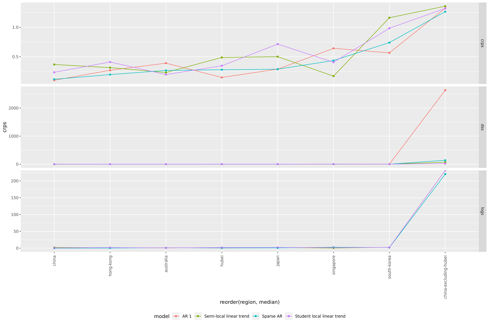
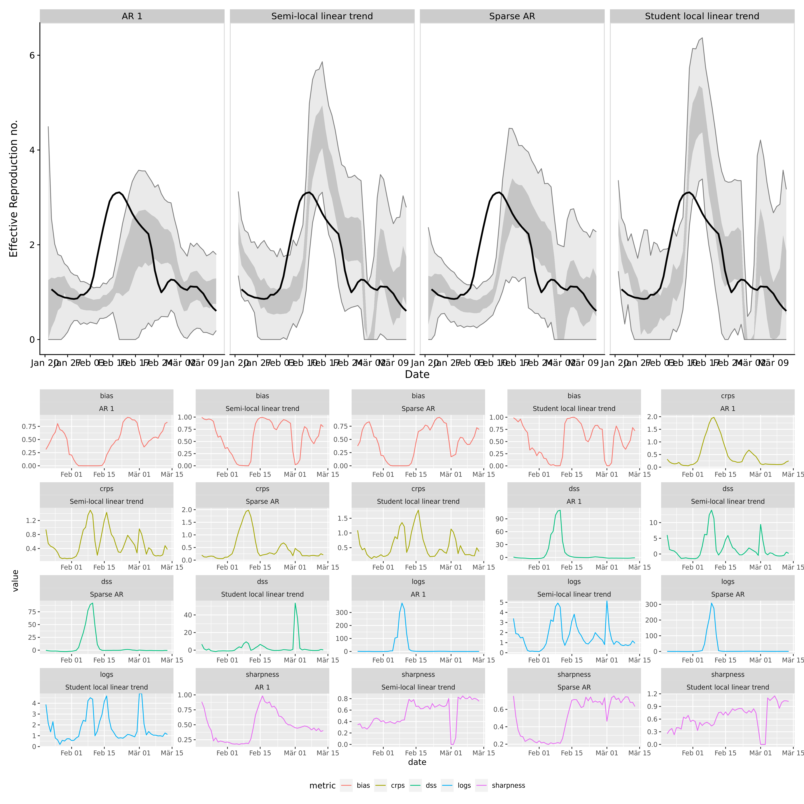

Covid Forecast Model Selection
================

## Workplan

## Overview Scoring Rules

### Bias

should be around 0.5 (between -1 and 1 according to Gunnar, but that
seems just wrong)

### Sharpness

Median Absolute Deviation, i.e., the (lo-/hi-) median of the absolute
deviations from the median. Smaller is better.

### CRPS

generalisation of Brier score to continuous variables. Smaller is
better.

### LogS

**Advantage**: logarithmic Score penalises underestimating uncertainty
heavily. I feel this is what we want.

**Drawback**: In contrast to the CRPS, the computation of LogS requires
a predictive density. An estimatorcan be obtained with classical
nonparametric kernel density estimation (KDE, e.g. Silverman1986).
However, this estimator is valid only under stringent theoretical
assumptions and canbe fragile in practice: If the outcome falls into the
tails of the simulated forecast distribution,the estimated score may be
highly sensitive to the choice of the bandwidth tuning parameter.In an
MCMC context, a mixture-of-parameters estimator that utilizes a
simulated sampleof parameter draws rather than draws from the posterior
predictive distribution is a better

–\> especially problematic I think if we work with traces and only small
sample sizes?

**Question** do we now the posterior distribution of our draws?

### DSS

proper scoring rule that only depends on the first two moments. Smaller
is better.

## 

## Predictions over time horizons

### 1 day ahead

### 3 days ahead

### 7 days ahead

### 14 days ahead

### 21 days ahead

## Scoring by metrics

### Bias

### CRPS

### logS

### DSS

### Sharpness

## Scoring by days

### 1 day ahead

##### **Conclusion**

Across the bench, Sparse AR seems the most reasonable (little bias, ok
DSS and LogS)

AR1 seems to be very unconfident (and therefore performs well on LogS)
AR1 seems to be downward biased.

| horizon | score     | model                      |      bottom |       lower |      median |        mean |       upper |       top |         sd |
| ------: | :-------- | :------------------------- | ----------: | ----------: | ----------: | ----------: | ----------: | --------: | ---------: |
|       1 | bias      | AR 1                       |   0.0080000 |   0.1860000 |   0.3905000 |   0.4197689 |   0.6250000 | 0.9595000 |  0.2772750 |
|       1 | bias      | Semi-local linear trend    |   0.0120000 |   0.2722500 |   0.4800000 |   0.4836653 |   0.6907500 | 0.9934750 |  0.2745576 |
|       1 | bias      | Sparse AR                  |   0.0140500 |   0.2732500 |   0.4415000 |   0.4432570 |   0.6007500 | 0.9489500 |  0.2455554 |
|       1 | bias      | Student local linear trend |   0.0120000 |   0.2452500 |   0.4660000 |   0.4862390 |   0.7400000 | 0.9889500 |  0.2895952 |
|       1 | crps      | AR 1                       |   0.0101867 |   0.0292209 |   0.0496502 |   0.0804964 |   0.0908336 | 0.3520052 |  0.0970162 |
|       1 | crps      | Semi-local linear trend    |   0.0092356 |   0.0186063 |   0.0307310 |   0.0589323 |   0.0637748 | 0.2901038 |  0.0791821 |
|       1 | crps      | Sparse AR                  |   0.0103291 |   0.0246476 |   0.0372596 |   0.0660410 |   0.0766843 | 0.3237791 |  0.0816737 |
|       1 | crps      | Student local linear trend |   0.0077607 |   0.0161175 |   0.0285822 |   0.0581726 |   0.0657830 | 0.2963876 |  0.0783066 |
|       1 | dss       | AR 1                       | \-6.4081542 | \-4.3556485 | \-3.1301046 | \-2.8061977 | \-2.0187648 | 2.4022130 |  3.5155217 |
|       1 | dss       | Semi-local linear trend    | \-6.6064909 | \-5.4001019 | \-4.4365827 | \-3.4039877 | \-3.0640898 | 5.6251181 |  5.5025561 |
|       1 | dss       | Sparse AR                  | \-6.3403357 | \-4.6895059 | \-3.9733682 | \-3.2789461 | \-2.3513212 | 2.0815847 |  3.5105402 |
|       1 | dss       | Student local linear trend | \-6.7544456 | \-5.4803737 | \-4.4320114 | \-3.3146278 | \-2.8404630 | 4.7867443 |  5.9490699 |
|       1 | logs      | AR 1                       | \-2.3516078 | \-1.3373002 | \-0.8712790 | \-0.5973268 | \-0.2245719 | 2.6490532 |  1.8376894 |
|       1 | logs      | Semi-local linear trend    | \-2.4011705 | \-1.7499162 | \-1.3185821 | \-0.0632782 | \-0.5770308 | 2.6046985 | 10.6262543 |
|       1 | logs      | Sparse AR                  | \-2.2742154 | \-1.4547978 | \-1.0760557 | \-0.4869469 | \-0.3510247 | 2.1962172 |  6.6138710 |
|       1 | logs      | Student local linear trend | \-2.5637118 | \-1.9861798 | \-1.4052472 | \-0.0809180 | \-0.5353133 | 3.1767137 | 11.1970500 |
|       1 | sharpness | AR 1                       |   0.0270395 |   0.0730474 |   0.1076575 |   0.1362156 |   0.1715399 | 0.4037328 |  0.0989903 |
|       1 | sharpness | Semi-local linear trend    |   0.0292870 |   0.0438936 |   0.0759519 |   0.1035307 |   0.1164945 | 0.3782497 |  0.0914737 |
|       1 | sharpness | Sparse AR                  |   0.0281568 |   0.0612873 |   0.1052844 |   0.1394959 |   0.1584550 | 0.4441418 |  0.1273435 |
|       1 | sharpness | Student local linear trend |   0.0222886 |   0.0380191 |   0.0557680 |   0.0917445 |   0.1073016 | 0.3563071 |  0.0863139 |

### 3 day ahead

#### Scoring

##### **Conclusion**

AR1 seems very bad in terms of bias and everything.

Sparse AR is the best in terms of crps, AR1 the worst. Sparse AR also
best with dss

–\> take Sparse AR

All models have a tendency to be downwards biased, the local and
semilocal ones tend to do a bit better.

| horizon | score     | model                      |      bottom |       lower |      median |        mean |       upper |        top |         sd |
| ------: | :-------- | :------------------------- | ----------: | ----------: | ----------: | ----------: | ----------: | ---------: | ---------: |
|       3 | bias      | AR 1                       |   0.0000000 |   0.0735000 |   0.3410000 |   0.3902982 |   0.6562500 |  0.9860000 |  0.3231420 |
|       3 | bias      | Semi-local linear trend    |   0.0050000 |   0.2125000 |   0.4555000 |   0.4798136 |   0.7817500 |  0.9986250 |  0.3220311 |
|       3 | bias      | Sparse AR                  |   0.0000000 |   0.1577500 |   0.3955000 |   0.4237785 |   0.6425000 |  0.9832500 |  0.2995765 |
|       3 | bias      | Student local linear trend |   0.0033750 |   0.1910000 |   0.4380000 |   0.4856228 |   0.7867500 |  0.9982500 |  0.3287758 |
|       3 | crps      | AR 1                       |   0.0164429 |   0.0632751 |   0.1111931 |   0.1816778 |   0.2183764 |  0.8391543 |  0.2042630 |
|       3 | crps      | Semi-local linear trend    |   0.0199180 |   0.0476855 |   0.0903064 |   0.1616771 |   0.1824046 |  0.7707849 |  0.2079662 |
|       3 | crps      | Sparse AR                  |   0.0190907 |   0.0489743 |   0.0953043 |   0.1535442 |   0.1807402 |  0.7460374 |  0.1856064 |
|       3 | crps      | Student local linear trend |   0.0168029 |   0.0490093 |   0.0861813 |   0.1692337 |   0.2037845 |  0.9086105 |  0.2278852 |
|       3 | dss       | AR 1                       | \-5.7523054 | \-2.9788105 | \-1.7181326 |   0.0659997 | \-0.3214171 | 15.9102891 | 10.1308226 |
|       3 | dss       | Semi-local linear trend    | \-5.0696145 | \-3.4282586 | \-2.3150460 |   0.2284952 | \-0.6315108 | 18.8387007 | 15.1851117 |
|       3 | dss       | Sparse AR                  | \-5.0893487 | \-3.4022191 | \-2.2443317 | \-0.9142318 | \-0.6633021 | 16.0607899 |  5.6334128 |
|       3 | dss       | Student local linear trend | \-5.1049417 | \-3.2627570 | \-2.1765028 | \-0.0712919 | \-0.6249551 | 15.8084657 | 10.8358287 |
|       3 | logs      | AR 1                       | \-1.9576532 | \-0.6315737 | \-0.0286593 |   2.9121943 |   0.9444399 |  8.3190947 | 22.8390010 |
|       3 | logs      | Semi-local linear trend    | \-1.6304220 | \-0.7493319 | \-0.2138140 |         Inf |   0.6412694 | 15.0739556 |        Inf |
|       3 | logs      | Sparse AR                  | \-1.6879827 | \-0.7530458 | \-0.1899264 |   1.1110839 |   0.5448895 |  5.5963112 |  9.3162127 |
|       3 | logs      | Student local linear trend | \-1.8682007 | \-0.8397704 | \-0.2895923 |         Inf |   0.8173786 |  5.5636130 |        Inf |
|       3 | sharpness | AR 1                       |   0.0310117 |   0.1197644 |   0.1712382 |   0.2185140 |   0.2919571 |  0.6146275 |  0.1596005 |
|       3 | sharpness | Semi-local linear trend    |   0.0448152 |   0.1040028 |   0.1698169 |   0.1982319 |   0.2466923 |  0.7182105 |  0.1536501 |
|       3 | sharpness | Sparse AR                  |   0.0393702 |   0.1299643 |   0.1694644 |   0.2235151 |   0.2729458 |  0.6719199 |  0.1711399 |
|       3 | sharpness | Student local linear trend |   0.0343422 |   0.0914051 |   0.1411028 |   0.1886089 |   0.2398148 |  0.7732401 |  0.1695911 |

### 7 days ahead

| horizon | score     | model                      |      bottom |       lower |      median |      mean |     upper |         top |         sd |
| ------: | :-------- | :------------------------- | ----------: | ----------: | ----------: | --------: | --------: | ----------: | ---------: |
|       7 | bias      | AR 1                       |   0.0000000 |   0.0305000 |   0.2340000 | 0.3406351 | 0.5777500 |   0.9977750 |  0.3207735 |
|       7 | bias      | Semi-local linear trend    |   0.0010000 |   0.1245000 |   0.4555000 | 0.4629514 | 0.7827500 |   0.9980000 |  0.3453798 |
|       7 | bias      | Sparse AR                  |   0.0000000 |   0.0720000 |   0.3675000 | 0.3906459 | 0.6615000 |   0.9945500 |  0.3217249 |
|       7 | bias      | Student local linear trend |   0.0034500 |   0.1492500 |   0.4610000 | 0.4791946 | 0.7980000 |   0.9987750 |  0.3405127 |
|       7 | crps      | AR 1                       |   0.0237678 |   0.0960116 |   0.1857228 | 0.2955098 | 0.3946808 |   1.1168065 |  0.3121035 |
|       7 | crps      | Semi-local linear trend    |   0.0399012 |   0.1090727 |   0.1981111 | 0.3140519 | 0.4360475 |   1.1921736 |  0.3001370 |
|       7 | crps      | Sparse AR                  |   0.0432188 |   0.0844265 |   0.1635945 | 0.2610888 | 0.3281690 |   0.9150013 |  0.2852256 |
|       7 | crps      | Student local linear trend |   0.0319151 |   0.1285761 |   0.2182245 | 0.3465975 | 0.4452252 |   1.3017779 |  0.3641722 |
|       7 | dss       | AR 1                       | \-5.0529295 | \-2.1116999 | \-0.9486481 | 7.8874438 | 1.6099643 |  75.1686650 | 53.2973291 |
|       7 | dss       | Semi-local linear trend    | \-3.4492815 | \-1.8213095 | \-0.8431559 | 5.7522375 | 1.0772263 |  29.4807890 | 57.5437701 |
|       7 | dss       | Sparse AR                  | \-3.7290359 | \-2.4864360 | \-1.2975935 | 2.1013875 | 0.8160169 |  33.7009999 | 11.4105880 |
|       7 | dss       | Student local linear trend | \-3.1526853 | \-1.5676692 | \-0.5059338 | 2.3143832 | 1.2395309 |  26.9223396 | 17.4728669 |
|       7 | logs      | AR 1                       | \-1.6469611 | \-0.1862844 |   0.4575571 |       Inf | 2.0977521 | 133.8684222 |        Inf |
|       7 | logs      | Semi-local linear trend    | \-0.8702571 |   0.0531860 |   0.6150591 |       Inf | 1.5742947 |  64.6989266 |        Inf |
|       7 | logs      | Sparse AR                  | \-0.9441767 | \-0.2999462 |   0.2810207 | 4.6497351 | 1.3725644 |  20.9503585 | 27.0332360 |
|       7 | logs      | Student local linear trend | \-1.1839989 |   0.1761904 |   0.6842636 |       Inf | 1.6256690 | 273.9563772 |        Inf |
|       7 | sharpness | AR 1                       |   0.0349965 |   0.1691771 |   0.2460824 | 0.3057967 | 0.4133362 |   0.9203690 |  0.2316235 |
|       7 | sharpness | Semi-local linear trend    |   0.0000000 |   0.1697449 |   0.3092458 | 0.3373103 | 0.4295277 |   0.8052232 |  0.2336642 |
|       7 | sharpness | Sparse AR                  |   0.0537510 |   0.1769637 |   0.2431955 | 0.2990138 | 0.3303729 |   0.7902818 |  0.2042039 |
|       7 | sharpness | Student local linear trend |   0.0000000 |   0.1720308 |   0.3345330 | 0.3777638 | 0.4916669 |   1.0344513 |  0.3343831 |

### 14 days ahead

| horizon | score     | model                      |      bottom |       lower |      median |       mean |     upper |        top |          sd |
| ------: | :-------- | :------------------------- | ----------: | ----------: | ----------: | ---------: | --------: | ---------: | ----------: |
|      14 | bias      | AR 1                       |   0.0000000 |   0.0135000 |   0.2220000 |  0.3116846 | 0.5030000 |   1.000000 |   0.3200756 |
|      14 | bias      | Semi-local linear trend    |   0.0020000 |   0.0885000 |   0.3350000 |  0.4174659 | 0.7575000 |   0.990050 |   0.3465923 |
|      14 | bias      | Sparse AR                  |   0.0000000 |   0.0125000 |   0.2950000 |  0.3531685 | 0.6295000 |   0.957500 |   0.3234279 |
|      14 | bias      | Student local linear trend |   0.0139000 |   0.1320000 |   0.3990000 |  0.4484301 | 0.7430000 |   0.985100 |   0.3289778 |
|      14 | crps      | AR 1                       |   0.0335856 |   0.1375773 |   0.2462624 |  0.4147992 | 0.5281402 |   1.856200 |   0.4455997 |
|      14 | crps      | Semi-local linear trend    |   0.0793567 |   0.1919530 |   0.3146997 |  0.5050492 | 0.6477006 |   1.798096 |   0.5020982 |
|      14 | crps      | Sparse AR                  |   0.0606336 |   0.1168247 |   0.2136598 |  0.3936231 | 0.4891568 |   1.869009 |   0.4469477 |
|      14 | crps      | Student local linear trend |   0.0788096 |   0.2201375 |   0.3961209 |  0.5867447 | 0.7345232 |   1.984991 |   0.6112888 |
|      14 | dss       | AR 1                       | \-4.2580235 | \-1.4838933 | \-0.3875600 | 53.1288720 | 3.7123344 | 473.335952 | 355.8044540 |
|      14 | dss       | Semi-local linear trend    | \-2.5452295 | \-0.9568288 | \-0.0362917 |  9.9814570 | 2.2139444 |  65.350047 |  90.5184714 |
|      14 | dss       | Sparse AR                  | \-3.2051358 | \-1.7379334 | \-0.7522603 |  7.2520291 | 2.7236760 |  75.087795 |  26.9582388 |
|      14 | dss       | Student local linear trend | \-1.9943268 | \-0.4764472 |   0.6081701 |  5.6446427 | 1.9254041 |  13.013435 |  63.5809658 |
|      14 | logs      | AR 1                       | \-1.2078627 |   0.2458156 |   0.8472780 |        Inf | 3.2302493 |        Inf |         Inf |
|      14 | logs      | Semi-local linear trend    | \-0.3101312 |   0.5834656 |   1.1589241 |        Inf | 2.2983405 |        Inf |         Inf |
|      14 | logs      | Sparse AR                  | \-0.6660663 |   0.0654051 |   0.5824193 | 14.0855857 | 2.1425211 | 173.874522 |  61.2007764 |
|      14 | logs      | Student local linear trend | \-0.4708208 |   0.8439186 |   1.4452099 |        Inf | 2.1914378 |        Inf |         Inf |
|      14 | sharpness | AR 1                       |   0.0329083 |   0.1993808 |   0.3296000 |  0.3637842 | 0.4719614 |   1.086160 |   0.2522039 |
|      14 | sharpness | Semi-local linear trend    |   0.0000000 |   0.2300625 |   0.3947365 |  0.4972462 | 0.7065726 |   1.502997 |   0.4054781 |
|      14 | sharpness | Sparse AR                  |   0.0835340 |   0.1994929 |   0.3027100 |  0.3513953 | 0.3877486 |   1.095796 |   0.2491342 |
|      14 | sharpness | Student local linear trend |   0.0000000 |   0.1670901 |   0.4814912 |  0.6085576 | 0.9148659 |   2.055006 |   0.5593290 |

### 21 days ahead

| horizon | score     | model                      |      bottom |       lower |      median |       mean |     upper |        top |          sd |
| ------: | :-------- | :------------------------- | ----------: | ----------: | ----------: | ---------: | --------: | ---------: | ----------: |
|      21 | bias      | AR 1                       |   0.0000000 |   0.0090000 |   0.1660000 |  0.3114253 | 0.5250000 |   0.999500 |   0.3367350 |
|      21 | bias      | Semi-local linear trend    |   0.0055000 |   0.0920000 |   0.3610000 |  0.4348643 | 0.7690000 |   0.985000 |   0.3465707 |
|      21 | bias      | Sparse AR                  |   0.0000000 |   0.0120000 |   0.3140000 |  0.3443348 | 0.6470000 |   0.921000 |   0.3273120 |
|      21 | bias      | Student local linear trend |   0.0240000 |   0.1980000 |   0.4050000 |  0.4670000 | 0.7500000 |   0.975000 |   0.3064901 |
|      21 | crps      | AR 1                       |   0.0235764 |   0.1607730 |   0.3177785 |  0.5070274 | 0.6941321 |   1.987461 |   0.4935879 |
|      21 | crps      | Semi-local linear trend    |   0.0980552 |   0.2591496 |   0.4229265 |  0.6370391 | 0.7729879 |   2.756221 |   0.6788510 |
|      21 | crps      | Sparse AR                  |   0.0462926 |   0.1277933 |   0.2904460 |  0.4679007 | 0.6102723 |   2.034037 |   0.4929226 |
|      21 | crps      | Student local linear trend |   0.1085912 |   0.2731977 |   0.5074682 |  0.7785265 | 0.9108566 |   3.168600 |   0.9466353 |
|      21 | dss       | AR 1                       | \-4.6069415 | \-1.0815082 |   0.1624104 | 91.3327444 | 6.3480268 | 529.056224 | 591.1769803 |
|      21 | dss       | Semi-local linear trend    | \-2.0662364 | \-0.4916795 |   0.4901097 | 18.0294045 | 1.9068587 |  53.683590 | 179.2855097 |
|      21 | dss       | Sparse AR                  | \-3.4044389 | \-1.5845888 | \-0.2702617 |  7.4069067 | 3.3398820 |  90.777872 |  28.1997211 |
|      21 | dss       | Student local linear trend | \-1.6339690 | \-0.0292194 |   1.1029341 |  2.1107550 | 2.2205292 |   9.919692 |   6.2186932 |
|      21 | logs      | AR 1                       | \-1.4546480 |   0.4273530 |   1.1779060 |        Inf | 3.4579409 |        Inf |         Inf |
|      21 | logs      | Semi-local linear trend    | \-0.0258806 |   0.9112704 |   1.4480704 |        Inf | 2.2740219 |        Inf |         Inf |
|      21 | logs      | Sparse AR                  | \-0.8044235 |   0.0710294 |   0.8436638 | 11.1228016 | 2.5644809 |  79.451618 |  56.7227038 |
|      21 | logs      | Student local linear trend | \-0.0520093 |   1.1308824 |   1.6722319 |        Inf | 2.3592900 |        Inf |         Inf |
|      21 | sharpness | AR 1                       |   0.0238265 |   0.2243352 |   0.3728773 |  0.4033955 | 0.5296797 |   1.163644 |   0.2764973 |
|      21 | sharpness | Semi-local linear trend    |   0.0000000 |   0.2018072 |   0.4735850 |  0.6459497 | 0.9680663 |   2.302249 |   0.6264441 |
|      21 | sharpness | Sparse AR                  |   0.0978555 |   0.2446217 |   0.3422660 |  0.4056539 | 0.4491018 |   1.267412 |   0.2737175 |
|      21 | sharpness | Student local linear trend |   0.0000000 |   0.0000000 |   0.5287538 |  0.7701699 | 1.2390178 |   3.414396 |   0.8405296 |

## Performance by countries

### 1 day(s) ahead

### 3 day(s) ahead

### 7 day(s) ahead

### 14 day(s) ahead

### 21 day(s) ahead

## Region performance vs metrics

### australia

### austria

### belgium

### china

### china-excluding-hubei

### france

### hong-kong

### hubei

### iran

### italy

### japan

### netherlands

### singapore

### south-korea

### spain

### united-states

