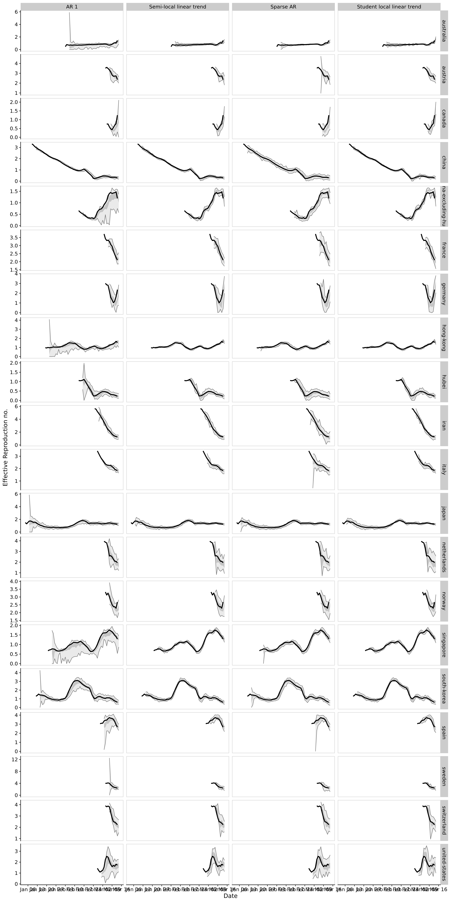
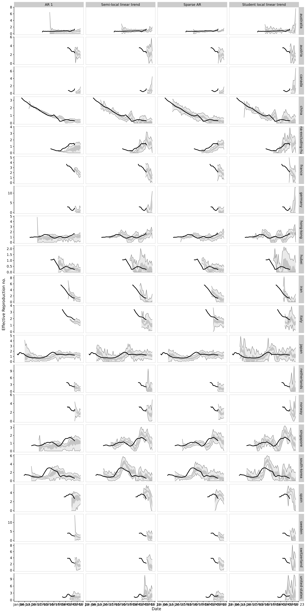

```{r setup, include=FALSE}
knitr::opts_chunk$set(echo = TRUE)

library(EpiSoon)
evaluations <- readRDS("forecast_evaluation.rds")

```

## Overview Scoring Rules {.tabset}


### Bias
should be around 0.5 (between -1 and 1 according to Gunnar, but that seems just wrong)

### Sharpness
smaller is better. 

### CRPS
generalisation of Brier score to continuous variables. Smaller is better. 

### LogS

**Advantage**: logarithmic Score penalises underestimating uncertainty heavily. I feel this is what we want. 

**Drawback**: In contrast to the CRPS, the computation of LogS requires a predictive density. An estimatorcan be obtained with classical nonparametric kernel density estimation (KDE, e.g. Silverman1986). However, this estimator is valid only under stringent theoretical assumptions and canbe fragile in practice: If the outcome falls into the tails of the simulated forecast distribution,the estimated score may be highly sensitive to the choice of the bandwidth tuning parameter.In an MCMC context, a mixture-of-parameters estimator that utilizes a simulated sampleof parameter draws rather than draws from the posterior predictive distribution is a better

--> especially problematic I think if we work with traces and only small sample sizes?

**Question** do we now the posterior distribution of our draws?

### DSS


## Performance over time horizons {.tabset}

```{r horizons, include=FALSE}
horizon <- summarise_scores(evaluations$scores, variables = "horizon")

```

### 1 day ahead {.tabset}

#### Predictions


#### Scoring

##### **Conclusion**
Across the bench, Sparse AR seems the most reasonable (little bias, ok DSS and LogS)


AR1 seems to be very unconfident (and therefore performs well on LogS)
AR1 seems to be downward biased. 


```{r horizon-1, echo=FALSE}
horizon %>% dplyr::filter(horizon == 1) %>% knitr::kable(booktabs = TRUE)

```


### 3 day ahead {.tabset}

#### Predictions


#### Scoring

##### **Conclusion**
AR1 seems very bad in terms of bias and everything. 

Sparse AR is the best in terms of crps, AR1 the worst. 
Sparse AR also best with dss

--> take Sparse AR

All models have a tendency to be downwards biased, the local and semilocal ones tend to do a bit better. 


```{r horizon-3, echo=FALSE}
horizon %>% dplyr::filter(horizon == 7) %>% knitr::kable(booktabs = TRUE)

```


### 7 days ahead {.tabset}


#### Predictions


#### Scoring 

##### **Conclusion**
Sparse AR still downwards biased
local and semilocal doing better

crps: student local is best (it shouldn't?), Semilocal and Sparse AR about equal. Sparse AR most consistent. 

dss: student local doing best, then Sparse AR and semilocal

LogS: student local best, then Sparse AR wide ahead of the others. 

Sparse AR most consistent. 


```{r horizon-7, echo=FALSE}
horizon %>% dplyr::filter(horizon == 3) %>% knitr::kable(booktabs = TRUE)

```


